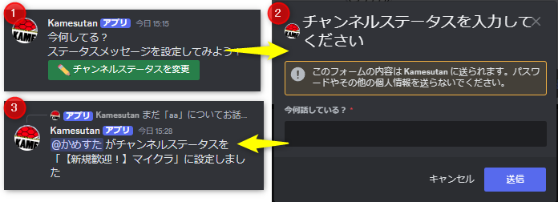

# Discord VCチャンネルステータス変更催促Bot

## 概要

このBotは、DiscordのVCでチャンネルステータスを変更せずに会話しているユーザーに対して、ステータスメメージを変更するように促すBotです。  
また、スマホでもコマンドを使ってステータスメッセージを変更することができます。



## 使い方

1. config.default.tomlをconfig.tomlにコピーし、設定してください。
2. env.sampleを.envにコピーし、設定してください。
3. `npm install`で依存関係をインストールしてください。
4. `npm run start`でBotを起動してください。

## コマンド

- `/vc status` : VCのチャンネルステータスを変更します。スマホでも使えます。

## 設定

```toml
# サーバーID
guild_ids = ["0000000000000000000"]

# ステータスメッセージをつけるべき人数
num_user_to_describe = 5

# ステータスメッセージを設定するべき時間 (分)
minute_to_set_status = 10

# ステータスメッセージを変更するべき時間 (分)
minute_to_modify_status = 60
```
